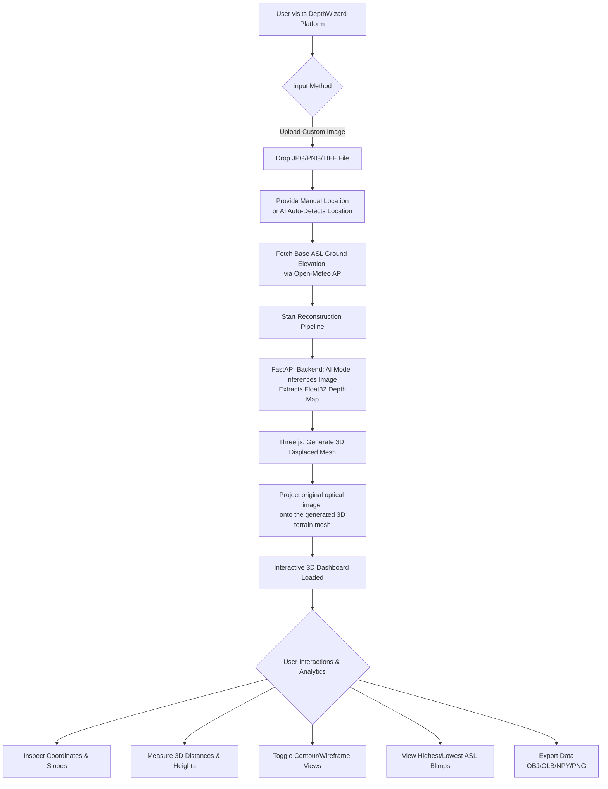

# DepthWizard: Single-View 3D Terrain Reconstructions
**Comprehensive Technical Document & ISRO Hackathon Pitch**

---

## 1. The Core Problem: The Challenge of Monocular Depth
Generating accurate 3D terrain models and elevation data is critical for disaster management, urban planning, defense logistics, and environmental monitoring. 

The specific challenge (Problem Statement) asks for an AI-powered solution capable of generating a 3D terrain mesh and elevation map from a **single, monocular optical satellite image**. Mathematically, single-view depth estimation is an *ill-posed problem*. A single 2D image lacks the geometric cues (parallax) required to calculate depth directly via triangulation. A single pixel in a 2D image could represent a point 10 meters away or 10,000 meters away, leading to severe depth ambiguity.

---

## 2. Why Existing Traditional 3D Software is Insufficient

Traditional high-quality elevation generation relies on multi-sensor or multi-pass techniques, which include:

### Stereo Satellite Imagery (Photogrammetry)
Requires two or more images of the exact same target area captured from different viewpoints to calculate depth.
```text
Satellite A          Satellite B
      \                  /
       \                /
        \              /
         \            /
          TARGET (Ground)
```
*The spatial difference (parallax) between viewpoints yields depth.*

### LiDAR (Light Detection and Ranging)
Uses active laser pulses fired from aircraft or drones to physically measure precise distances to the ground, canopy, and buildings.

### InSAR (Interferometric Synthetic Aperture Radar)
Radar images from different orbital observations are combined to derive elevation by measuring phase differences in the radar waves.

**The Strategic Drawback for ISRO:**
While highly accurate, these traditional methods are **expensive, sensor-dependent, weather-dependent, and computationally demanding**. 
- In rapid-response disaster scenarios (e.g., floods, landslides), waiting days for a satellite to achieve the correct orbit for stereo imagery is unacceptable. 
- LiDAR requires deploying aircraft, which is geographically restricted and costly.
- Radar (InSAR) is complex and difficult to interpret visually for rapid situational awareness.

That is precisely why ISRO requires a **single-view optical alternative**—to instantly generate actionable, readable 3D intelligence from *any* standard, readily available optical satellite image without waiting for orbital revisit times.

---

## 3. Competitive Analysis: DepthWizard vs. Traditional Platforms (e.g., Google Earth)

When evaluating solutions, it is crucial to understand the fundamental difference between DepthWizard and existing heavyweights like Google Earth or ArcGIS.

**Google Earth / Traditional 3D Maps:**
- **What they provide:** Pre-rendered, globally compiled 3D meshes created using massive, expensive stereo-photogrammetry and LiDAR databases over years. They offer excellent visual fidelity for historical, static data.
- **What they DO NOT provide:** **On-the-fly generation from new data.** If a flood, landslide, or military event alters the terrain today, Google Earth will continue showing the outdated terrain from months or years ago until a massive data update occurs. Furthermore, they are closed ecosystems; you cannot upload your own single satellite image and ask Google Earth to instantly convert it into a 3D mesh, nor can you easily extract the raw mathematical depth arrays (`.npy`) for custom engineering.

**DepthWizard:**
- **What it provides:** True **instantaneous, on-the-fly 3D generation** from *any* single 2D optical image. It is decentralized and data-agnostic. If you have an image taken *today*, DepthWizard gives you the 3D terrain *today*. 
- **The DepthWizard Advantage:** It empowers the user to upload custom, unmapped, or newly altered terrain imagery and instantly generates actionable 3D intelligence. It also provides raw, open-format data exports (OBJ, GLB, Float32 NPY) for integration into specialized CAD or defense software, filling a critical gap in rapid-response scenarios.

---

## 4. Our Proposed Solution: DepthWizard

**DepthWizard** is an end-to-end AI platform that democratizes 3D terrain generation. 

By utilizing a state-of-the-art Monocular Depth Estimation model, DepthWizard analyzes the semantic features of a single RGB satellite image (shadows, textural gradients, contextual semantics) to infer physical depth. 

**Fulfilling the Core Requirements:**
1. **Single-Image Processing:** Converts any standard JPG/PNG/TIFF satellite image into a high-precision `Float32` depth array.
2. **True-to-Life Projection (Explicit PS Requirement):** The official Problem Statement explicitly asks for projecting the original optical image onto the generated 3D terrain mesh. DepthWizard accomplishes this perfectly by generating a high-density vertex grid, displacing it using the AI depth map, and seamlessly projecting the original RGB texture onto the 3D geometry in real-time.
3. **Real-World Metric Calibration:** Integrates with geospatial APIs to anchor the AI's relative depth map to real-world Above Sea Level (ASL) altitudes dynamically.
4. **Actionable 3D Analytics:** Provides in-browser tools to inspect coordinates, measure 3D distances/slopes, view contour lines, and automatically highlight the Highest and Lowest elevation points.

---

## 5. Technology Stack & Architecture

DepthWizard is built on a modern, decoupled architecture designed for speed, precision, and scalability.

### Frontend / Client-Side (Visualization & UI)
- **React.js & Vite:** Provides a lightning-fast, reactive user interface.
- **Three.js & React Three Fiber (R3F):** Powers the high-performance WebGL 3D rendering engine. It handles custom GLSL shaders (for Metric DSM rendering and Hybrid contour mapping) and manages a dense 65,536+ vertex geometry smoothly in the browser.
- **Zustand:** Lightweight, un-opinionated state management for handling complex geospatial data and 3D camera states.
- **D3.js (d3-contour, d3-geo):** Utilized to dynamically compute and draw topographic contour lines directly from the `Float32` depth array on the client side.

### Backend / AI Inference Layer
- **FastAPI (Python):** A high-performance, asynchronous backend framework that handles image ingestion and inference queuing.
- **Depth Anything V2 (PyTorch):** The core AI model. A state-of-the-art foundational model for monocular depth estimation. The inference pipeline includes specialized heuristics adapted for remote sensing (e.g., establishing flat baselines for water bodies, elevating building footprints, and neutralizing artificial map text).
- **OpenCV & NumPy:** Used for high-speed, matrix-based image preprocessing and ensuring the depth output is returned as a lossless `Float32` array rather than a compressed 8-bit image, preserving the mathematical linearity of the terrain.

### Geospatial Data APIs
- **Open-Meteo API:** Queried dynamically to fetch the precise real-world Above Sea Level (ASL) ground elevation datum based on the image's geographical coordinates.
- **Overpass API (OpenStreetMap):** Used to fetch real-world 3D building footprints and metadata to overlay contextual architecture onto the terrain.
- **Nominatim Geocoding:** Converts manual user location queries (e.g., "Delhi, India") into precise latitude/longitude bounding boxes.

---

## 6. Technical Pipeline Implementation

1. **Ingestion & Geolocation:** A user uploads a single optical image. The system parses EXIF/GeoTIFF metadata, utilizes AI location detection, or accepts manual user input to determine the exact Latitude and Longitude.
2. **ASL Calibration:** The system queries the Open-Meteo API with the coordinates to establish the baseline ASL ground elevation.
3. **AI Depth Extraction:** The image is processed by the PyTorch backend. The output is a raw `Float32` array. This is critical because standard 8-bit grayscale depth maps (0-255) suffer from quantization loss and non-linear CLAHE distortions. `Float32` maintains exact physical height proportionality.
4. **3D Mesh Construction:** The frontend receives the `Float32` array and generates a dense `PlaneGeometry` in Three.js. A custom algorithm loops through the vertices, displacing their Z-axis based on the `Float32` values. 
5. **Texture Projection:** The original RGB optical image is applied as a `MeshStandardMaterial` map, perfectly projecting the satellite imagery onto the newfound 3D topography.
6. **Analytics Computation:** The system calculates surface normals for slope estimation and renders HTML-anchored floating blimps at the exact `Min` and `Max` ASL coordinates for immediate visual intelligence.

---

## 7. User Flowchart

The following flowchart illustrates the seamless experience a user has when interacting with the DepthWizard platform.


